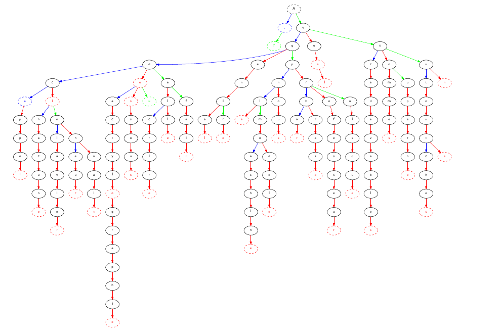
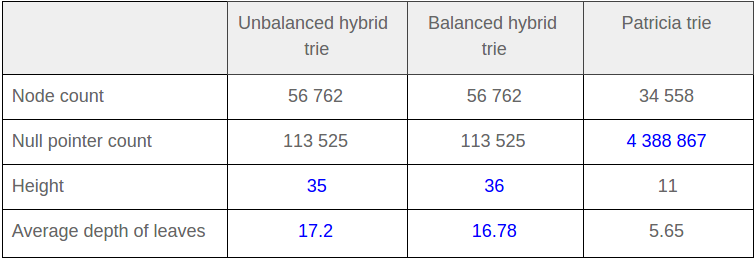
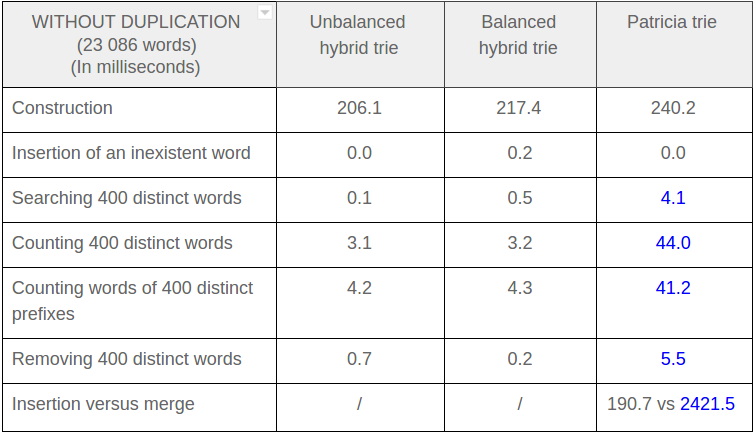

# ADP: Patricia Tries vs. Hybrid Tries
A project for the course "Algorithmique Avancée" at the university UPMC Paris.

## Introduction
For this project the two advanced data structures patricia trie and hybrid trie have been implemented and compared
concerning their suitability for the implementation of a common alphabetic dictionary consisting of the first
128 ASCII characters. A possible field of application for such a dictionary could be in terms of auto-completion
for mobile text messaging or the implementation of a simple spell checking dictionary. Both trie types support
several primitive and more sophisticated operations, including rather complex functions for balancing,
conversion and merging.

## Patricia Trie
A patricia trie is a special form of a radix trie having edges that can not only be labelled with one single character
but also with a whole sequence of characters (i.e. prefixes). Compared to regular tries, its structure
is therefore more space efficient. Furthermore the end of a stored word is no longer indicated by a given key in
a leaf node but rather by a special character that is added to the edge representing the last characters of the word.
As this *end of word* character serves as a special indicator, words containing it can not be stored or represented
by the dictionary.

As the used alphabet for this project contains the first 128 characters of the character encoding standard ASCII,
the character *DEL* (With a decimal value of 127) was chosen to serve as the end of word character. This decision
seemed reasonable as the *DEL* character is a special character that is seldom used in spoken or written languages
as it is rather a computer-specific term.

## Hybrid Trie
The hybrid trie, also sometimes called digital tree or prefix tree, is a data structure which is able to handle
effectively digital inputs, as well as string inputs. Each node has always exactly three child nodes, conventionally
known as lower (left) child, middle child and higher (right) child. Their main characteristic is that the value of
the parent node is limited between the value of the lower and the higher child node so that the infix traversal
returns the elements in an ascending order.

## Examples
For the following example text the corresponding tries are obtained:
> A quel genial professeur de dactylographie sommes nous redevables de la superbe phrase ci dessous, un modele du
> genre, que toute dactylo connait par coeur puisque elle fait appel a chacune des touches du clavier de la
> machine a ecrire ?

###### The corresponding patricia trie (The mojibake represents the final character DEL)


###### The corresponding hybrid trie


## Graphical Representation
For a visual representation of the graphs, the language [xdot](https://github.com/jrfonseca/xdot.py) was used.
Further example files for both trie structures can be found in the folder ```drawables```.

## Experimental Study
Furthermore a small experimental study has been conducted. A patricia trie, a balanced hybrid trie and an
unbalanced hybrid trie have been constructed by inserting the total set of words contained in all works of the
English poet and writer William Shakespeare into each structure. An extract of the results is given in the
tables below and more details results can be found in the folder ```results```.

###### Results regarding the structural differences


###### Results regarding the time differences


## Remarks
Although both tries were showing good performance times during the tests, there are still several aspects that could
be improved: For example the internal representation of the tries, the removal of unnecessary and redundant
overhead code etc.
